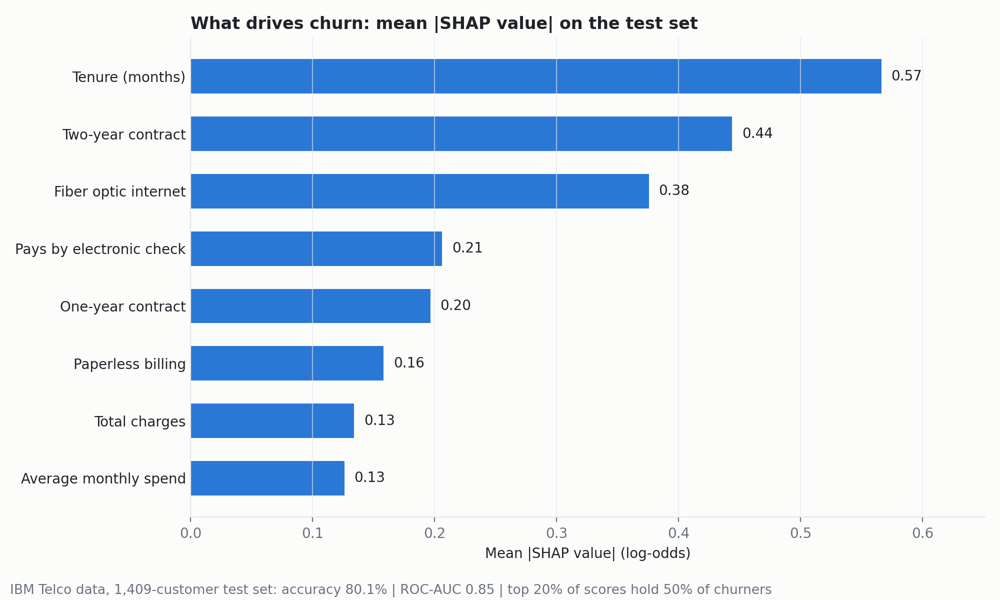
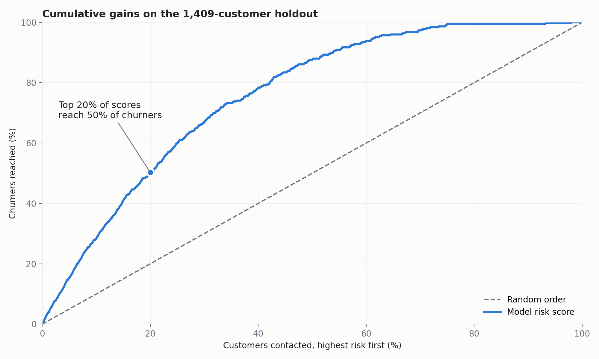
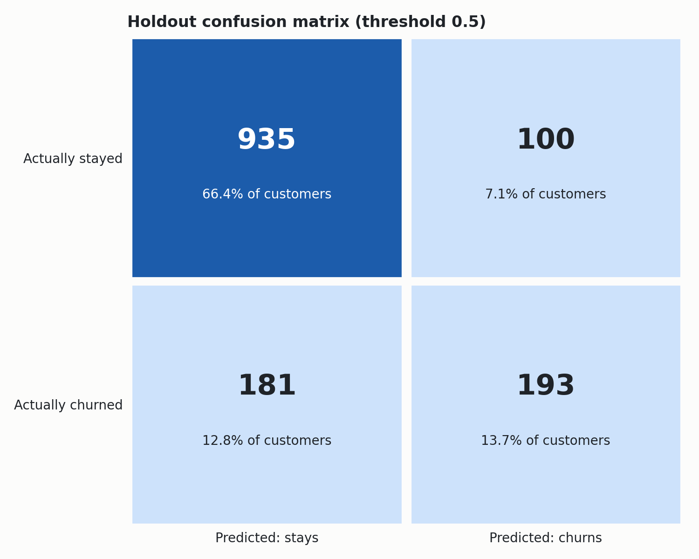

# Customer Churn Prediction

XGBoost model that predicts which telecom customers will cancel, trained on the public IBM Telco Customer Churn dataset (7,043 customers), with SHAP to explain the predictions.

📝 Write-up on Medium: [Predicting Customer Churn Without Fooling Yourself](https://medium.com/@bhargavpeddi/predicting-customer-churn-without-fooling-yourself-smote-xgboost-and-shap-0f65369e73d6)



## Results

Stratified 80/20 split, seed 42. Tuned with 5-fold cross-validation on the 5,634 training customers; the 1,409 test customers were scored once at the end.

| Metric (test set) | Value |
| --- | --- |
| Accuracy | **80.1%** |
| ROC-AUC | **0.85** |
| Churners in the top 20% of risk scores | 50.3% (2.5x lift over random) |
| Precision at 0.5 threshold | 65.9% |
| Recall at 0.5 threshold | 51.6% |
| Cross-validation accuracy (train) | 80.7% |

26.5% of customers churn, so predicting "nobody churns" scores 73.5%. The model beats that by 6.6 points, and the cross-validation and test accuracy are within a point of each other, so it isn't overfitting.

**SMOTE comparison.** Retraining the same model with SMOTE inside the pipeline raises recall from 51.6% to 60.7% but lowers precision from 65.9% to 60% and accuracy to 78.9%. The final model skips SMOTE; if a retention offer is cheap, the SMOTE version (or a lower threshold) is the better choice because it catches more churners.

**What drives churn (SHAP):** tenure, contract length (two-year and one-year contracts pull risk down), fiber optic internet, and paying by electronic check.

| Cumulative gains | Confusion matrix (threshold 0.5) |
| --- | --- |
|  |  |

## Data

[IBM Telco Customer Churn](https://github.com/IBM/telco-customer-churn-on-icp4d) (Apache 2.0), included in `data/` so the project runs offline. One row per customer: demographics, tenure, contract, billing, charges, subscribed services, and whether they churned. See `data/SOURCE.md`.

Cleaning: 11 customers with zero tenure have a blank `TotalCharges` because they haven't been billed yet; those are set to 0, and the loader fails if a blank shows up for anyone else.

## How it works

1. `prepare.py` validates the file (unique IDs, Yes/No target), fixes the blank charges, one-hot encodes categories, and adds two features: average monthly spend and number of add-on services.
2. Split off a stratified 20% test set before any fitting.
3. `train.py` tunes XGBoost with a 40-candidate randomized search and 5-fold CV on the training split.
4. Score the test set once, compare against a SMOTE variant, and compute mean absolute SHAP values on 500 test customers.

## Run it

Python 3.9+. On macOS, XGBoost needs OpenMP: `brew install libomp`.

```bash
python3 -m venv .venv && source .venv/bin/activate
pip install -r requirements.txt matplotlib
python train.py            # about a minute; writes outputs/metrics.json, feature_impact.csv, holdout_scores.csv
python make_charts.py      # writes the charts in docs/
python -m unittest -v
```

## Next steps

- Time-based validation instead of a random split
- Probability calibration so scores can drive retention budgets
- Choose the threshold from the cost of a retention offer versus the value of a saved customer
